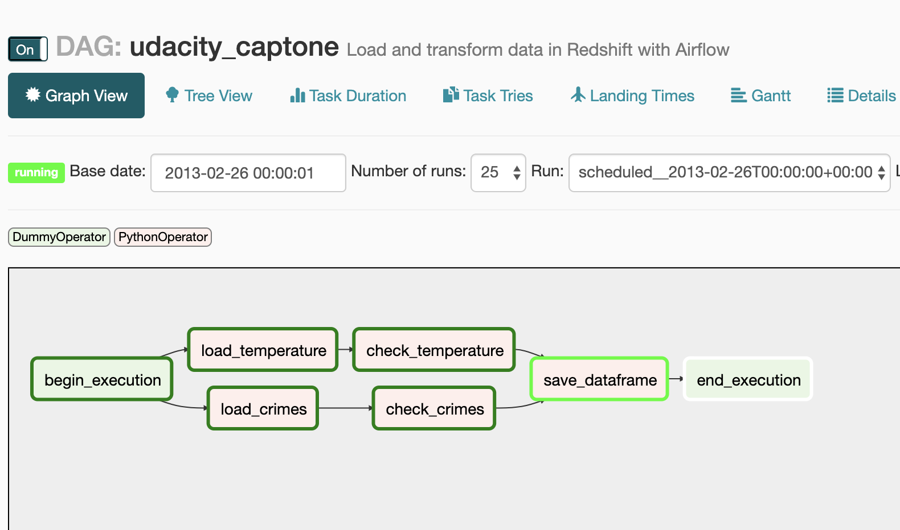
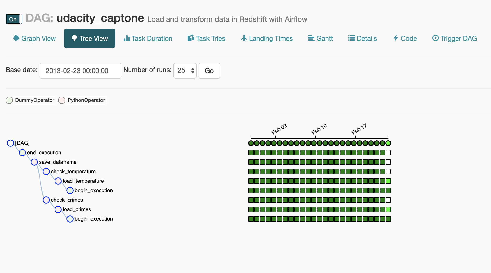
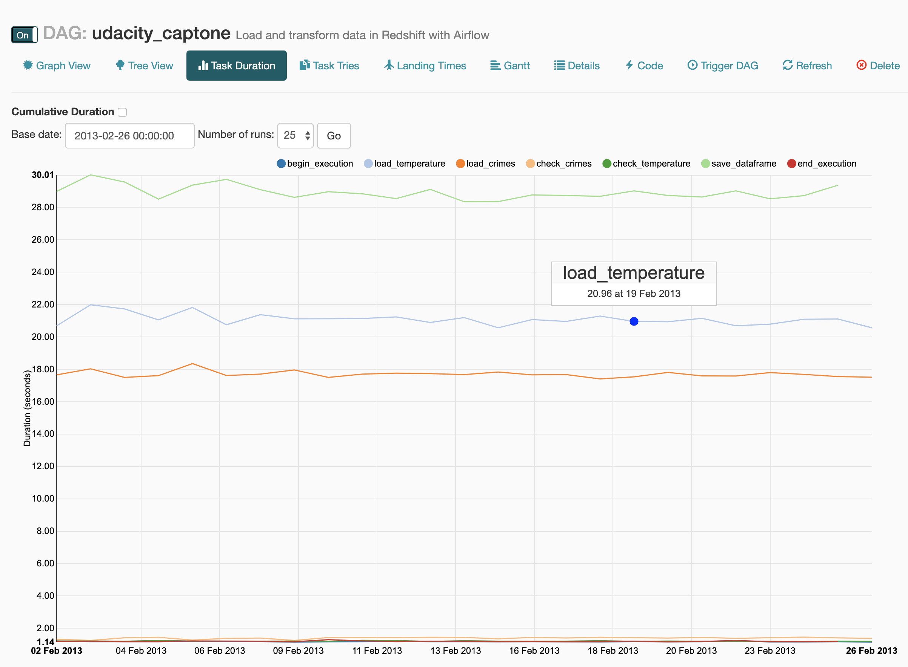
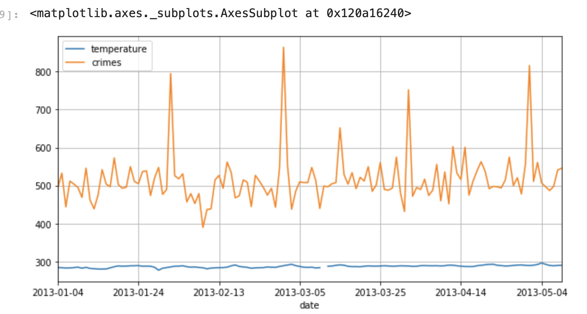

## Purpose
Analyse any possible correlation between crimes and temperature

## Execution

Crime data and temperature date are already at s3 and the main aim is to extract the data and process the data then store the data in a bucket for analysts to retrieve. 

## Data

### Temperature: 
[Historical Hourly Weather Data 2012-2017](https://www.kaggle.com/selfishgene/historical-hourly-weather-data)

Field | Type | Details
------| ----- | ---- 
datetime | datetime | YYYY/MM/DD
Vancouver | float | Kelvin

Note: This data is available for 30 US and Canadian Cities, as well as 6 Israeli cities. I only show Vancouver.

___
### Crimes:
[Los Angeles 2010 to Present  Open Data](https://data.lacity.org)

To comply with the project requirements, the data contains more than 2,000,000 Rows

Field | Type | 
------| ----- | 
DR number | int | 
datetime | datetime | 
Crime code | int | 
Crime code description | varchar | 
Reporting District | int | 
Area Name | varchar |
Area ID | int |
Date Occured | datetime
day | int |
hour | int |
year | int | 
month | int |

This dataset partitioned by YYYY/MM/DD and stored on s3 as csv.

## Process

Airflow Steps:
* Load Temperture and Crime Data
* Processing Temperature and Crime Data
* Data quality check for Temperature and Crime
* Modify existing dataframe and put it into parquet form

#### Airflow Dag

#### Airflow Tree View

#### Airflow Running Jobs

## Results

The parquet form dataframe:

Field | Type | 
------| ----- | 
day| int | 
crime_count | int | 
temperature | int | 
year | int | 
month | int | 
day | int |

### Sample Graph

## Scaling
Airflow can handle the processing of millions of records by scaling horizontally! 

## Credit
Thanks to @sariabod for the inspiration

